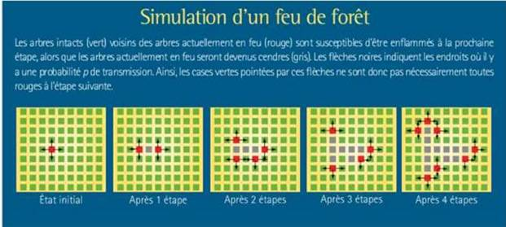
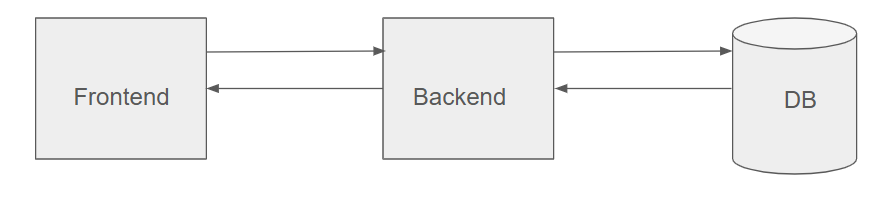

= Spread of forest fire

Simulation de la propagation d’un feu de forêt.

== Énoncé

L'objectif est d'implémenter une simulation de la propagation d’un feu de forêt.

Durée indicative de l’exercice : environ 2h/3h

La forêt est représentée par une grille de dimension h x l.

La dimension temporelle est discrétisée. Le déroulement de la simulation se fait donc étape par étape.

Dans l’état initial, une ou plusieurs cases sont en feu.

Si une case est en feu à l’étape t, alors à l’étape t+1 :

* Le feu s'éteint dans cette case (la case est remplie de cendre et ne peut ensuite plus brûler)
* et il y a une *probabilité p* que le feu se propage à chacune des 4 cases adjacentes

La simulation s’arrête lorsqu’il n’y a plus aucune case en feu

Les dimensions de la grille, la position des cases initialement en feu, ainsi que la probabilité de propagation, sont des paramètres du programme stockés dans un fichier de configuration (format libre).

== Objectifs

Ce qui nous intéresse n’est pas de simplement voir un programme de simulation tourné avec la meilleure IHM mais surtout de comprendre :

- Comment vous appréhendez un problème
- Comment vous codez
- Quels sont vos choix architecturaux
- Comment vous présentez votre travail une fois réalisé

== Environnement de développement

- OS : Windows 10
- IDE : Intellij IDEA Community Edition 2025.2
- Apache Maven : 3.9.9
- Node : 22.18.0
- npm : 11.5.2

== Architecture technique

La solution prend la forme d'une application web, composée d'un Frontend pour la présentation, d'un Backend pour l'application serveur, et d'une base de données pour persister les données.

=== Frontend

Le Frontend est une application web en Javascript/Typescript/Vue 3.

=== Backend

Le Backend est une application serveur Java 24/Spring Boot 3.

=== Base de données

La base de données utilisée est H2. Elle est construite au démarrage de l'application serveur et détruite à son exinction.
