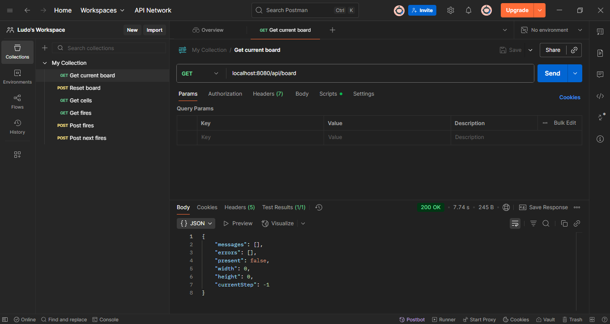

= Server

- Java: 24
- Maven

== Project Setup

[source,sh]
----
mvn clean install
----

== Lancement de l'application

== depuis l'IDE

Exécuter `SimulationApplication::main()`

== depuis un terminal

Aller dans ./server/target :

[source,sh]
----
java -jar server-0.0.1-SNAPSHOT.java
----

Une fois lancée, l'application est disponible en local : http://localhost:8080/

== Tester l'application via Postman

- Importer le fichier `./src/e2e/postman/simulator_collection.postman_collection_2.1`

== Application

Il s'agit d'une application Serveur qui expose différents services sous forme d'une API HTTP REST.

Les ressources exposées sont :

- le `board` : définit le périmètre du simulateur. Il prend la forme d'un quadrilatère, avec sa longueur, `witdh`, et sa largeur, `height`.
- les `cells` : définissent les unités de terrain dans le périmètre. Chaque unité est définit par sa position, via les coordonées `x` et `y`.
- le `fire` est l'élément qui fait évoluer l'état des cellules. Initialement, elles sont définies comme `green`, puis elles s'enflamment (`burning`), et enfin meurent (`dead`).

Les webservices mis à disposition sont :

- `HTTP GET /api/board` : permet de consulter les informations courantes sur le plateau.
- `HTTP POST /api/board` : permet d'initialiser le plateau, via la définition de ses dimensions. Les anciennes données sur les cellules et le plateau sont perdues.
- `HTTP GET /api/cells` : liste les cellules, avec leur position et leur état courant
- `HTTP POST /api/fires` : permet de changer l'état d'une cellule pour la mettre en feu
- `HTTP POST /api/fires/next` : permet de propager le feu à partir des cellules déjà en feu, à l'état courant.

== Comment jouer une simulation

1) Initialiser le plateau avec l'API `HTTP POST /api/board`. Ses dimensions doivent avoir une valeur entre 1 et 10.

2) Eventuellement, vérifier que le plateau est initialisé avec `HTTP GET /api/board`

3) Eventuellement, vérifier l'état des cellules avec `HTTP GET /api/cells`

4) En l'état, propager le feu n'aura aucun effet. Il faut d'abord déclarer un ou plusieurs incendies avec `HTTP POST /api/fires`

5) Puis utiliser plusieurs fois l'incendie avec `HTTP POST /api/fires/next`, et observer l'état des cellules au fur et à mesure, jusqu'à ce qu'il n'y ait plus aucune propagation.

6) A la fin, toutes les cellules devraient être déclarées comme `dead`.
